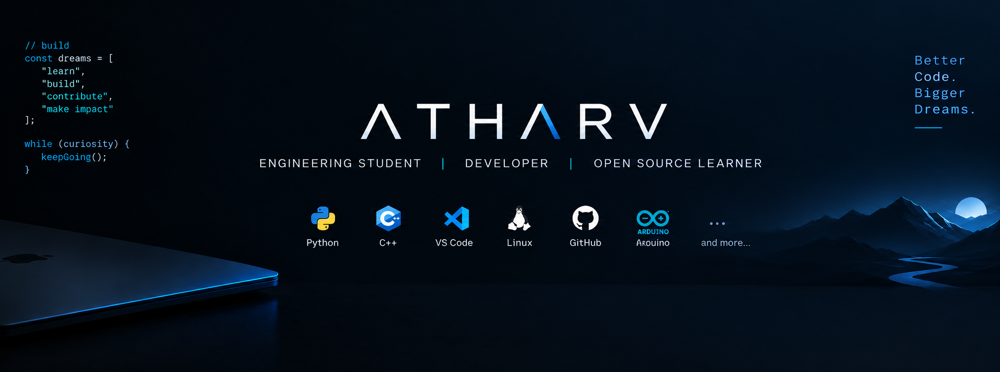

<div align="center">



<br>

<a href="https://github.com/atharvworks">
  
</a>
<a href="https://www.linkedin.com/">
  
</a>
<a href="https://instagram.com/">
  
</a>

</div>

---

## 👋 Hi, I'm Atharv

> **Engineering Student · Developer · Open Source Learner**

I'm currently learning, building projects, and exploring software development, AI/ML, and open source.

```text
┌──────────────────────────────────────────────────────────────┐
│  $ whoami                                                    │
│  atharv                                                       │
│                                                              │
│  $ current_focus                                             │
│  C++ • Python • Git/GitHub • Problem Solving • Open Source   │
│                                                              │
│  $ next_milestones                                            │
│  Build → Contribute → Intern → GSoC                           │
└──────────────────────────────────────────────────────────────┘
```

### 🚀 What I'm Working Toward

- 🧠 Strengthening programming fundamentals and problem solving
- 🛠️ Building practical software projects
- 🌐 Learning how real open-source projects work
- 🤝 Making meaningful open-source contributions
- 🎯 Preparing for internships and GSoC

---

## 🧰 Tech Stack

<table>
<tr>
<td align="center" width="120">

**Languages**

</td>
<td align="center" width="120">

**Tools**

</td>
<td align="center" width="120">

**Exploring**

</td>
</tr>
<tr>
<td align="center">

🐍 Python<br>
⚡ C++<br>
🌐 HTML/CSS<br>
🟨 JavaScript

</td>
<td align="center">

🔧 Git<br>
🐙 GitHub<br>
💻 VS Code<br>
🐧 Linux

</td>
<td align="center">

🤖 AI / ML<br>
🧩 DSA<br>
🌐 Web Development<br>
🌱 Open Source

</td>
</tr>
</table>

---

## 🔥 Featured Projects

> These cards are placeholders for now. We'll replace them with your real repositories as you build them.

### 🤖 Nexus — Personal Assistant
A Windows/Python personal assistant focused on voice interaction, automation, system tracking, and productivity.

**Stack:** `Python` `STT` `TTS` `Selenium` `psutil`

### 🧹 System Cleaner
A lightweight Windows utility for cleaning temporary files with user confirmation and safety-focused checks.

**Stack:** `Python` `Windows`

### 📊 Active System Tracker
A system-monitoring project for CPU, RAM, storage, processes, and application activity.

**Stack:** `Python` `psutil`

---

## 📈 GitHub Activity

<div align="center">


</div>

---

## 🌐 Connect With Me

<div align="center">

<a href="https://github.com/atharvworks">GitHub</a>
&nbsp; • &nbsp;
<a href="https://www.linkedin.com/">LinkedIn</a>
&nbsp; • &nbsp;
<a href="https://instagram.com/">Instagram</a>
&nbsp; • &nbsp;
<a href="mailto:YOUR_EMAIL@example.com">Email</a>

</div>

---

<div align="center">

### `while (curiosity) { keepBuilding(); }`

**Better Code. Bigger Dreams.**

</div>
